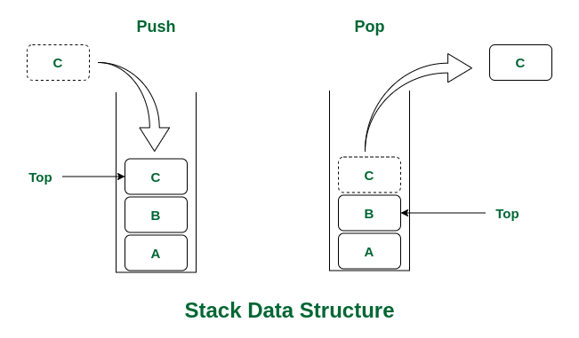

# Linear Data Structures

## Characteristics:

- ### Sequential organization:
  - Elements in a linear data structure are stored one after another in a well-defined sequence.
  - Every element (except the first) has a unique predecessor.
  - Every element (except the last) has a unique successor

    ```cpp
    int nums[4] = {10, 20, 30, 40};
    ```

- ### Order preservation:
  - The sequence in which elements are stored in a linear data structure remains the same when they are accessed or removed.
  - The first element added will be the first one accessed or removed.
  - The last element added will be the last one accessed or removed.

- ### Fixed or Dynamic Size:
  - Refers to whether the size of a linear data structure is predefined or can change during program execution:

  - Fixed Size: some linear data structures, like arrays, have a size that is set when they are created and cannot be changed later

  - Dynamic Size: other linear data structures, like linked lists, can grow or shrink during program execution as elements are added or removed. Dynamic arrays, such as `std::vector`, can also resize automatically when needed.

- ### Efficient Access:
  - It means that elements in a linear data structure can be retrieved quickly, often without needing to search through the entire structure.
  - In arrays, each element is stored at a specific index, so you can directly access any element using that index in constant time `O(1)`.

## Types:

- [Arrays](#i-array)
- [Stacks](#ii-stack)
- Queues
- Linked Lists

---

## I. Array

- An array is a collection of elements if the same data type, stored in contiguous memory locations.

e.g:

Indexes: `0, 1, 2, 3, 4`

Elements: `[5, 10, 20, 25, 30]`

- Homogeneous elements: all elements within an array must be of the same data type.
- Contiguous memory allocation: all elements of array are stored next to each other in a single continuous block of memory.
- Zero-Based Indexing

### Complexity of Array operations:

- **Accessing elements:** `O(1)`
- **Insertion / Deletion:** appending/deleting an element to the end of an array is usually `O(1)` but insetion at the beginning or any specific index takes `O(n)` time because it requires shifting all of the elements.
- **Searching:** Linear search takes `O(n)`, but other algorithms like binary search (in sorted arrays) take `O(log n)`.

---

## II. Stack:

- A stack is a linear data structure that follows the Last-In-First-Out (LIFO) principle, meaning that the last eleemnt added to ther stack is the first one to be removed.



### Stack Operations:

- **push:** inserts element
- **pop:** removes element from the top and stack is returned
- **top:** returns the last inserted element, without removing it
- **size:** returns the size of the stack
- **isEmpty:** returns whether the stack is empty or not

e.g:

```cpp
#include <stack>

int main() {
    stack<float> s;

    for (int i = 0; i < 5; i++)
        s.push(i*10 + 2);

    if (s.empty())
        cout << "The stack is empty" << endl;
    else {
        int size = s.size();
        for (int i = 0; i < size; i++) {
            cout << "The top of the stack is: " << s.top() << endl;
            s.pop();
        }
    }

    cout << s.size() << endl;

    return 0;
}
```

### C++ Implementation:

```cpp
#define max 100

template <typename T>
class Stack {
    private:
    T stack_arr[max];
    int top;

    public:
    Stack() {
        top = -1;
    }

    bool isEmpty() {
        return top == -1;
    }

    bool isFull() {
        return top == (max-1);
    }

    void push(T value) {
        if (isFull()) {
            cout << "The stack is full." << endl;
            return;
        }

        top++;
        stack_arr[top] = value;
    }

    Stack pop() {
        if (isEmpty())
            cout << "The stack is already empty." << endl;
        else
            top--;

        return *this;
    }

    T get_top() {
        if (isEmpty()) {
            cout << "The stack is empty." << endl;
            return T();
        }

        return stack_arr[top];
    }

    int size() {
        return top+1;
    }
};
```
