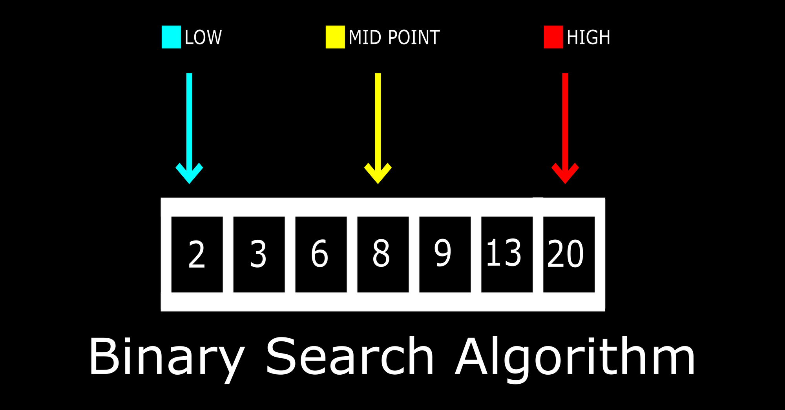

# Searching Algorithms

Process of locating a specific element or item within a collection of data. This collection of data can take various forms, such as arrays, lists, trees, or other structured representations.

## Aspects:

1. Target element
2. Search space
3. Complexity
4. Deterministic vs Non-deterministic

## I. Linear search algorithm:

- Iterates over all the elements of the array and check if the current element is equal to the target element

- Given a vector: `nums[]`, and an integer element `x` in the array, or `-1` if it doesn't exist.

e.g.

```cpp
int linearSearch(vector<int> &nums, int target) {
    for (int i = 0; i < nums.size(); i++) {
        if (nums[i] == target) return i;
    }

    return -1;
}
```

Complexity: `O(n)`

## II. Binary Search:

**nums must be sorted**

1. Divide the search space into two halves by finding the middle index
2. Compare the middle element of the search space with the key
   1. If the key is found at the middle element, the process is terminated.
   2. If the key is not found at the middle element, choose which half will be used as the next search space.
      - If the key is smaller than the middle element, then the left side is used for next search
      - If the key is larger than. the middle element, then the right side is used for the next search
3. This process is continued until the key is found or the total search space is exhausted



e.g.

```cpp
int binarySearch(vector<int> &nums, int target) {
    int low = 0;
    int high = nums.size() - 1;
    int mid;

    while (low <= high) {
        mid = low + (high - low) / 2;

        if (nums[mid] == target) {
            return mid;
        } else if (target > nums[mid]) {
            low = mid + 1;
        } else {
            high = mid - 1;
        }
    }

    return -1;
}
```

**note: (`nums` must be sorted)**

Complexity: `O(log n)`

**Advantages:**

- **Fast searching:** Faster than linear search, especially for large datasets.
- **Logarithmic time complexity:** Runs in **O(log n)**, significantly reducing the number of comparisons needed as the dataset grows.
- **Efficient for large datasets:** The search space is divided in half after every comparison.
- **Predictable performance:** Its worst-case time complexity is still **O(log n)**.
- **Simple to implement:** Relatively straightforward algorithm with a small amount of code.
- **Low memory usage:** The iterative version requires **O(1)** additional space.

**Disadvantages:**

- **Requires sorted data:** The data must be sorted before searching.
- **Sorting cost:** If the data isn't sorted, sorting it first adds an **O(n log n)** cost.
- **Random access needed:** Works best with data structures such as arrays where the middle element can be accessed efficiently.
- **Not ideal for frequently changing data:** Insertions and deletions may require maintaining the sorted order.
