# Sorting Algorithms

A sorting algorithm is used to rearrange a given list of elements in an order. For example:

- Input: `a = {10, 20, 5, 2}`
- Output: `a = {2, 5, 10, 20}`

There exist different sorting algorithms for different types of inputs, for example:

- Binary array
- Character array
- Array with a large range of values
- An array with many duplicates

The algorithms may also differ according to output requirements.

## Applications

- Finding an element: once data is sorted, the smallest or largest element can be retrieved in constant time `O(1)`.
- Searching algorithms: sorting is essential for search methods like binary search, where data must be ordered.
- Data Management: sorted data is easier to search, retrieve, and analyze.
- Database optimization: databases often keep records sorted by primary index, improving query speed and performance.
- Machine Learning: sorting is used during data preprocessing ro prepare datasets for training models.
- Operating Systems: sorting algorithms assist with task scheduling, memory management, and file system organization.

## Advantages

- Efficiency
- Improved performance
- Simplified data analysis
- Reduced memory consumption
- Improved data visualization

## Disadvantages:

- Insertion: keeping data in sorted order makes insertion costly, since the order must be mantained.
- Algorithm selection: choosing the right sorting algorithm for a specific
- Alternatives to sorting: in many cases, hashing is more efficient than sorting

## 5 sorting algorithms:

- [Selection Sort](#i-selection-sort)
- [Bubble Sort](#ii-bubble-sort)
- [Insertion Sort](#iii-insertion-sort)
- [Merge Sort](#iv-merge-sort)
- Quick Sort

---

## I. Selection Sort

- Comparison-based sorting algorithm
- It sorts an array by repeatedly selecting the smallest or largest element from the unsorted portion and swapping elements.

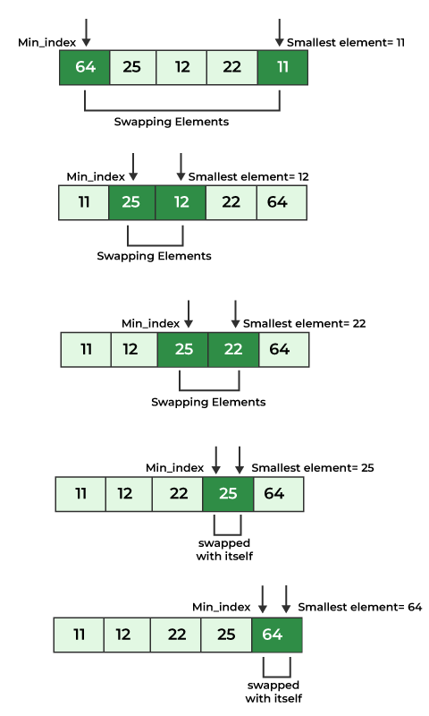

```cpp
void selectionSort(vector<int> &nums) {
    int n = nums.size();
    int min;

    for (int i = 0; i < n-1; i++) {
        min = i;
        for (int j = i+1; j < n; j++) {
            if (nums[j] < nums[min])
                min = j;
        }
        swap(nums[i], nums[min]);
    }
}
```

**Time Complexity: `O(n^2)`**

**Space Complexity: `O(1)`**

### Advantages:

- Simple to understand: easy to learn and implement.
- Low memory usage: requires only a constant amount of extra memory `O(1)`.
- Fewer swaps: performs fewer swaps than many other standard sorting algorithms.

### Disadvantages:

- Slow for large databases: with a time complexity of `O(n^2)`, it is much slower than algorithms like Quick Sort or Merge Sort.
- Not stable: It does not preserve the relative order of equal elements, so it is considered an unstable sorting algorithm.

  e.g

  Original array: `[4a, 5, 3, 4b, 2]` _(two 4s, labeled, a and b)_

  After Selection Sort: `[2, 3, 4b, 4a, 5]`

  _Notice that 4a and 4b have switched positions, so the original order is not preserved._

### Applications:

- Small lists: works well for small datasets, especially when memory writes are expensive, since it performs fewer swaps than many other algorithms.
- Foundation for other algorithms: algorithms like Heap Sort are based on the same idea as Selection Sort.

[↑ Back to algorithms list](#5-sorting-algorithms)

---

## II. Bubble Sort

- Simple sorting algorithm that works by repeatedly comparing and swapping adjacent elements if they are in the wrong order.
- It is not efficient for large datasets because its average and worst-case time complexity is high `O(n^2)`

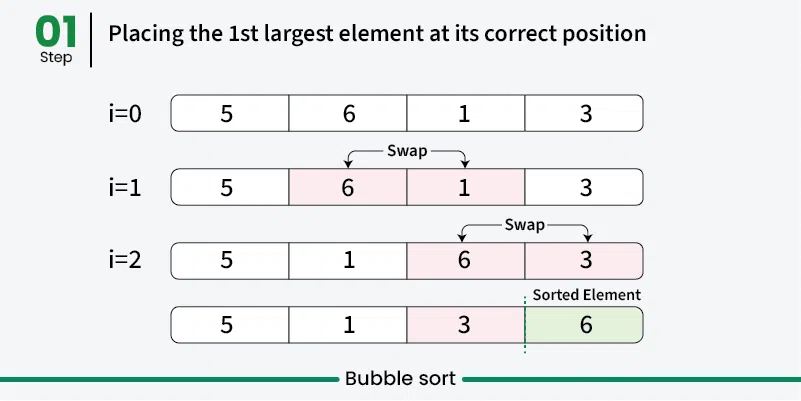
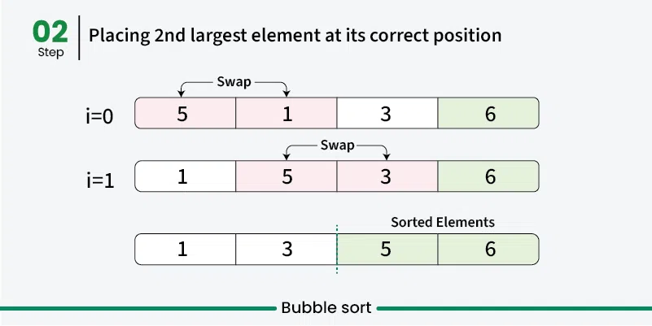
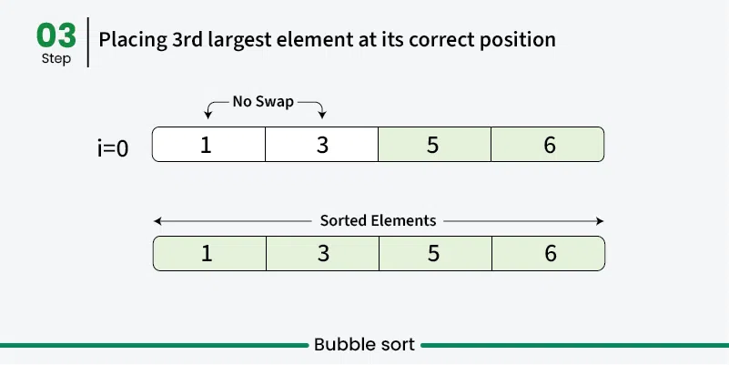

```cpp
void bubbleSort(vector<int> &nums) {
    int n = nums.size();
    bool checkSwap;
    for (int i = 0; i < n-1; i++) {
        checkSwap = false;
        for (int j = 0; j < n-i-1; j++) {
            if (nums[j] > nums[j+1]) {
                swap(nums[j], nums[j+1]);
                checkSwap = true;
            }
        }
        if (!checkSwap)
            break;
    }
}
```

**Time Complexity: `O(n^2)`**

**Space Complexity: `O(1)`**

**Best Case (array is already ordered): `O(n)`**

### Advantages

- Simple to understand: easy to learn and implement.
- Low memory usage: does not require extra memory (in-place sorting).
- Stable algorithm: elements with the same value keep their original relative order.

### Disadvantages:

- Slow for large datasets: the time complexity of `O(n^2)`, it is inefficient for big arrays

[↑ Back to algorithms list](#5-sorting-algorithms)

---

## III. Insertion Sort

- Is a simple sorting algorithm that works by iteratively inserting each element of an unsorted list into its correct position in a sorted portion of the list.
- It is like sorting playing cards in your hands. You split the cards into two groups:
  - Sorted Cards
  - Unsorted Cards
- Then, you pick a card from the unsorted group and put it in the right place in the sorted group.

1. It starts with the second element (`i = 1`) of the list as the first element is assumed to be sorted.
2. Compare the second element with the first element if the second element is smaller then swap them.
3. Move to the third element, compare it with the first two elements, and put it in its correct position.
4. Repeat the process until the array is sorted.

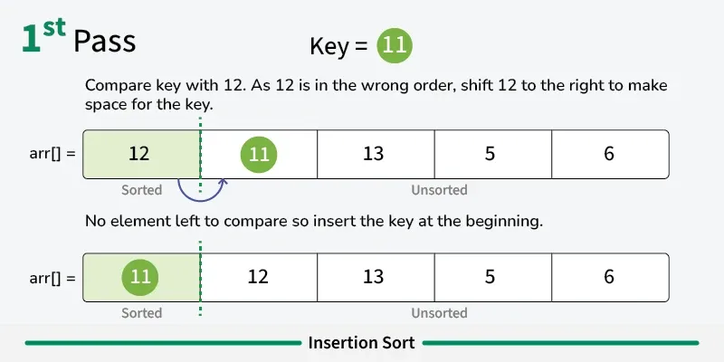
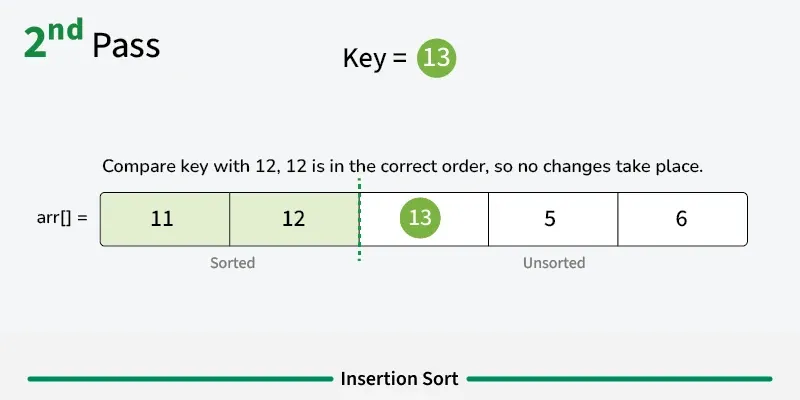
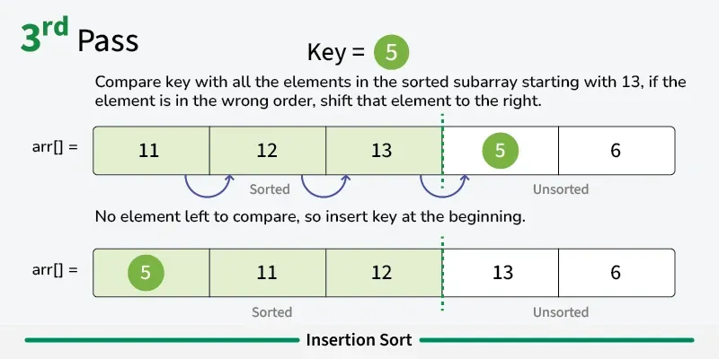
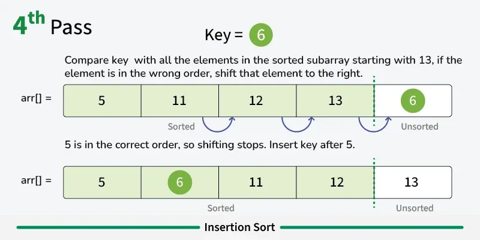
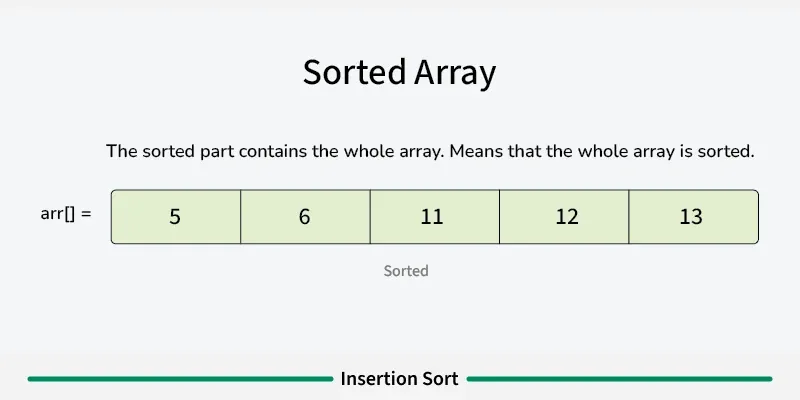

```cpp
void insertionSort(vector<int> &nums) {
    int curr;
    int prev;
    for (int i = 1; i < nums.size(); i++) {
        curr = nums[i];
        prev = i-1;

        while (prev >= 0 && nums[prev] > curr) {
            nums[prev+1] = nums[prev];
            prev--;
        }
        nums[prev+1] = curr;
    }
}
```

**Time Complexity: `O(n^2)`**

**Space Complexity: `O(1)`**

**Best Case (array is already ordered): `O(n)`**

### Advantages:

- Stable sorting algorithm.
- Efficient for small lists and nearly sorted lists.
- Space-efficient as it is an in-place algorithm.

### Disadvantages:

- Inefficient for large datasets, time complexity = `O(n^2)`
- Too many comparisons and shifts.
- Not suitable for random/unsorted data.
- Recursive inefficiency (if implemented recursively), Recursive versions of Insertion Sort can quickly cause stack overflow for large `n`.

[↑ Back to algorithms list](#5-sorting-algorithms)

---

## IV. Merge Sort

- A popular sorting algorithm known for its efficiency and stability.
- It works by recursively dividing the input list into two halves, recursively sorting the two halves and finally merging them back together to obtain the sorted list.

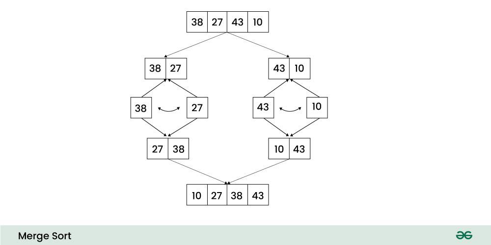

1. **Divide:** Divide the list or array recursively into two halves until it can no more be divided.
2. **Conquer:** Each subarray is sorted individually using the merge sort algorithm.
3. **Merge:** The sorted subarrays are merged back together in sorted order. The process continues until all elements from both subarrays have been merged.

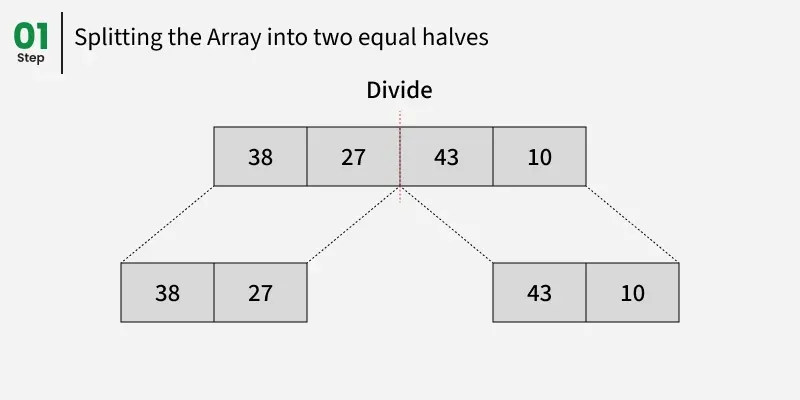
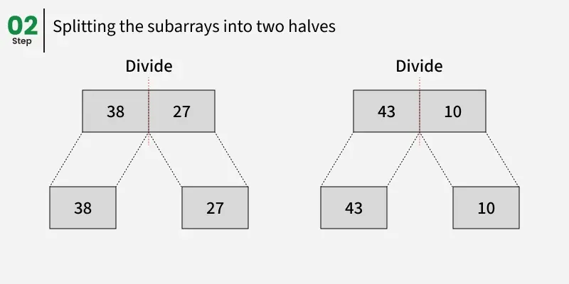
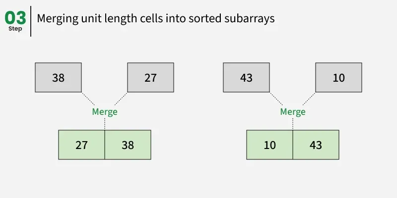
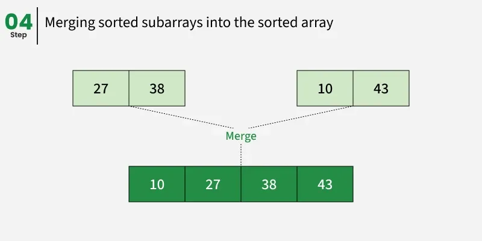

```cpp
void mergeSort(vector<int> &nums, int left, int right) {
    if (left >= right)
        return;

    int mid = (left + right) / 2;
    mergeSort(nums, left, mid);
    mergeSort(nums, mid+1, right);
    merge(nums, left, mid, right);
}
```

where, `merge(nums, left, mid, right)` is:

```cpp
void merge(vector<int> &nums, int left, int mid, int right) {
    int n1 = mid - left + 1;
    int n2 = right - mid;
    vector<int> L(n1), R(n2);

    for (int i = 0; i < n1; i++)
        L[i] = nums[i+left];

    for (int j = 0; j < n2; j++)
        R[j] = nums[j+mid+1];

    int i = 0, j = 0, k = left;
    while (i < n1 && j < n2) {
        if (L[i] <= R[j]) {
            nums[k] = L[i];
            i++;
        } else {
            nums[k] = R[j];
            j++;
        }
        k++;
    }

    while (i < n1) {
        nums[k] = L[i];
        i++;
        k++;
    }

    while (j < n2) {
        nums[k] = R[j];
        j++;
        k++;
    }
}
```

**Time Complexity: `O(n log n)`**

**Space Complexity: `O(n)`**

**Best Case (array is already ordered): `O(n log n)`**

### Advantages:

- Stability: It preserves the relative order of elements with equal values.
- Guaranteed Worst-Case Performance: With a worst-case time complexity of `O(n log n)`, Merge Stort remains efficient even for large datasets.
- Simplicity: Its divide-and-conquer strategy makes the algorithm conceptually straightforward.
- Parallelism: Since subarrays are processed independently

### Disadvantages:

- Space Complexity: It needs extra memory to hold temporary subarrays during the merge setup.
- Not In-Place: Unlike in-place algoriths, Merge Sort requires additional space to store intermediate results, which can be a drawback when memory is limited.

[↑ Back to algorithms list](#5-sorting-algorithms)
