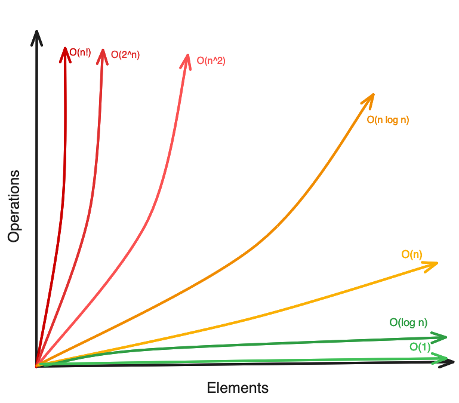

# Computational complexity

- Complexity is the study of the resources, primarily time and memory, required to solve a computational problem.
- It classifies problems based on their resource requirements and analyzes how these requirements scale with the size of the input.
- Understanding complexity helps determine the feasibility of solving problems with algorithms and guides the selection of efficient algorithms for practical applications.

## Time complexity: how much time (number of steps) the algorithm takes as input size grows.

Space complexity: how much memory the algorithm uses.

It does not measure time in seconds neither memory in MB directly, but instead in terms of how they grow relative to the input size (n).

## Memory usage:

Measures the amount of memory an algorithm uses while it runs, including:

- Memory for the input data
- Memory for auxiliary variables (temporary storage, counters, etc.)
- Memory for function calls (stack space in recursion)

The goal is to understand how the memory requirements grow as the size of the input increases.

e.g.

- An algorithm that uses a fixed number of variables regardless of input size has `O(1)` space complexity (constant space)
- An algorithm that stores an array of size `n` has `O(n)` space complexity (linear space)

Optimizing space is important for devices with limited memory or when working with very large datasets.

## Simplicity and clarity:

- An algorithm should be easy to understand
- Steps should be straightforward and not unnecessarily complicated
- Clear algorithms make it easier to find mistakes, maintain, and modify.
- Helps with collaboration, documentation, and teaching.

Example: Clear loops and descriptive variable names are better than tricky, confusing code, even if both work.

## Optimality:

- An algorithm is optimal if it solves a problem in the best way possible.
- Best usually means using the least time, least memory, or both.
- Even if an algorithm is correct and clear, it may not be optimal.

Example:
A sorting algorithm that sorts a list in `O(n log n)` time is more optimal than one that sorts in `O(n^2)`, even if both are correct and easy to understand.

Example of sorting a list of numbers using Bubble Sort

Suppose we have a list of 5 numbers (Input size = 5)

- Input A (already sorted): `[1, 2, 3, 4, 5]`
  - Bubble Sort will make very few comparisons/swaps because it detects the list is already sorted.
- Input B (reverse order): `[5, 4, 3, 2, 1]`
  - Bubble Sort will make many more comparisons/swaps to sort the list.

Even though both inputs have the same size (5 numbers), the amount of work the algorithm performs depends on the nature of the input.

## Asymptotic notations:

- ϴ (Big-Theta) Notation
  - It is used in CS to describe the tight bound of an algorithm’s running time or space complexity
- Ω (Big-Sigma) Notation
  - Describes the minimum amount of time or space an algorithm must take
- O (Big-O) Notation
  - It is the maximum amount of time or space an algorithm could take.
  - Upper bound: algorithm will not take more time than this.
  - Used to calculate the worst-case performance.

## Time growth rate:

- `O(1)`
- `O(log n)`
- `O(n)`
- `O(n log n)`
- `O(n^2)`
- `O(2^n)`
- `O(n!)`

